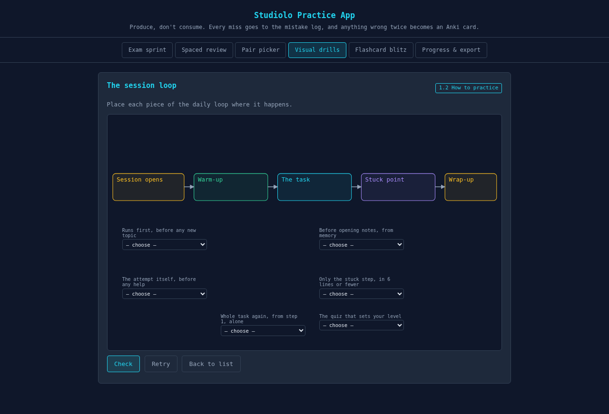

# Studiolo

> Your own little study. An AI-driven study system in plain markdown — any subject, any age.

A *studiolo* was a Renaissance scholar's private study: one small room holding their books,
maps, and instruments. This is yours — a folder your AI agent turns into a tutor that makes you
**produce** answers instead of consuming explanations.

## Why this exists

Most studying is rereading, highlighting, and rewatching. It feels like learning, but the
research is blunt: rereading mostly builds *familiarity*, not *recall*. What encodes memory is
producing — retrieving, explaining, applying, failing, fixing.

And most people use AI exactly backwards: as an Explainer, which is just another way to
consume. Studiolo puts AI to work on the jobs that make *you* work: interviewer, examiner,
Socratic questioner, sparring partner, diagnostician, clerk.

## What's inside

| Piece | What it does |
|-------|--------------|
| `learner-map.md` | Source of truth: topics, levels (0–5), dependencies, spaced review dates, root causes |
| `whats_due.py` | Prints today's queue: due reviews, next topic, deadline countdown, open root causes |
| `ai-tutor/` | The 10 AI roles, with copy-paste prompts for any AI chat |
| `practice/` | No-build practice app: timed sprints, pair drills, visual drills, spaced review, flashcard blitz |
| `labs/practice-library.md` | One hands-on task per topic: do it, break it, fix it |
| `mistake-log.md` | Every miss with the *why*. Wrong twice → becomes a flashcard |
| `anki/` + `import_anki.py` | Optional Anki sync (basic and cloze decks, straight from CSV) |



## Quickstart (5 minutes)

1. **Get your own copy** — fork, "Use this template", or clone. Keep it private: it will hold
   your personal learning data.
2. **Open the folder in an AI coding agent** (Droid, Claude Code, Cursor, Codex — anything that
   reads `AGENTS.md`) and say: *"Help me study."*
   The **Interviewer** fires first: up to 12 questions about your subject, deadline, level,
   and how you'll be tested. Then the agent builds your learner map, question bank, and
   practice tasks. No setup, no forms.
3. **Every day after**: run `python3 whats_due.py` (or just ask your agent) and do what the
   queue says. 30–80 minutes.

No agent? Fill in `learner-map.md` yourself and paste the role prompts from
`ai-tutor/prompts.md` into any AI chat. The map, the daily queue, and the practice app all
work without an agent too.

## How it works

The daily loop is the same every session; the map decides the topic:

```
due reviews → recall 3 things cold → attempt the task → unblock ONE step →
redo from scratch → break it on purpose → get examined (level 0–5) → log the misses → commit
```

The rules that make it stick:

- **Recall before review.** Try to produce it before you open your notes.
- **Wrong twice = flashcard.** Only repeated misses become cards. No card spam.
- **The ladder.** Miss a question → it returns after 1, 3, 7, then 14 days. Topics too: pass an
  Examiner review and the next review moves further out; drop a level and it's back tomorrow.
- **Struggle first.** Ten minutes alone before you may ask for help. The Explainer role answers
  only the one stuck step, in six lines or fewer, then you redo everything yourself.
- **Teach it simply.** If you can't explain it simply, you don't know it yet.

## Works for

| You are studying | "Produce" means |
|------------------|-----------------|
| School subjects (history, biology, …) | closed-book recall, timelines, cause→effect chains, essays, teach-back |
| University courses | past-paper problems, derivations, error-hunting in worked solutions |
| Professional certs (cloud, networking, accounting, …) | scenario questions, build-break-fix labs, incident drills |
| Languages | speaking and writing from prompts, unscripted conversation, drills |
| Anything skill-based (music, chess, art) | perform it, break it down, fix the weak step |

The Interviewer adapts the plan to the subject and the learner. A 12-year-old's math map looks
different from a sysadmin's cert map. The system is the same.

## Requirements

- Any AI chat (free tier is fine), or an AI coding agent for the automated flow
- Python 3 for `whats_due.py` and `import_anki.py` — no packages needed
- Anki, optional — only if you like a separate flashcard app
- Nothing else. No server, no accounts, no build step, no API keys. `practice/index.html`
  opens with a double-click.

## FAQ

**Do I need to know how to code?** No. You edit markdown files — or don't even do that: your
agent does the writing, you do the learning.

**Where do the practice questions come from?** Your agent generates them into
`practice/questions.js` after intake, from your actual syllabus, following the schemas in
`AGENTS.md`. The starter set teaches the learning science the system is built on.

**Is this just Anki?** No. Anki stores facts you already have. Studiolo decides *what to study
today* and at what difficulty, makes you produce full answers, finds the root cause behind
your mistakes, and only then feeds the survivors into cards.

**What about my data?** All local: markdown files and browser storage. Your instance is yours —
keep the repo private, and never publish your learner map or mistake log.

**A teacher, can I use this for a whole class?** Yes — run the Interviewer and Mapmaker once
against your syllabus, then hand each student the pre-mapped copy. They (and their agents)
take it from there.

## Origin and credits

Built by generalizing a real, working instance: an AWS CloudOps Engineer Associate exam-prep
repo used daily through a weeks-long sprint. The 10-role AI tutoring framework comes from
Nick Saraev's ["AI can teach you almost ANYTHING"](https://www.youtube.com/watch?v=FSXHk4hMrY8),
and the method is standard learning science: retrieval practice, spacing, interleaving,
desirable difficulty (see *Make It Stick*, Brown, Roediger & McDaniel).

## License

MIT — see [LICENSE](./LICENSE).
